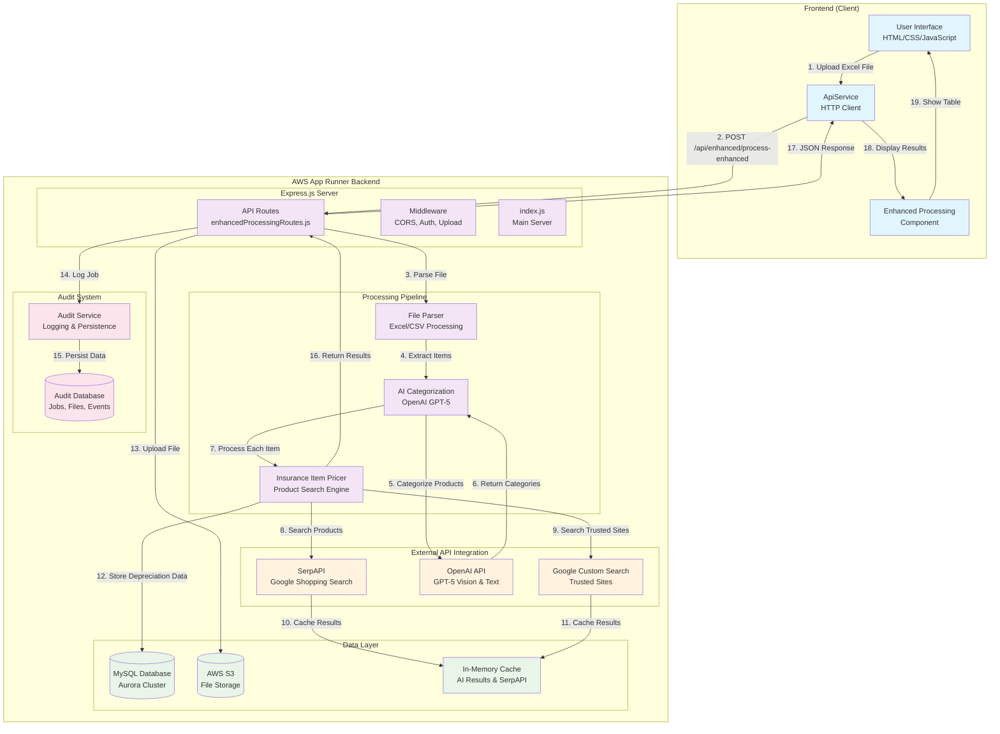
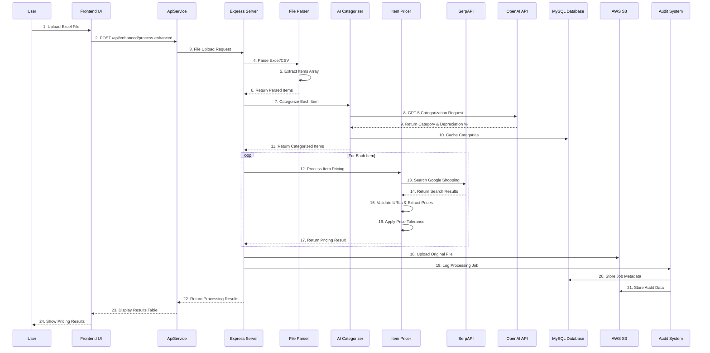

# 🏗️ Insurance Pricing System Architecture Diagram

## User Interaction Flow with App Runner Backend

## Detailed Processing Flow

## Key Components Breakdown

### 🎯 **Frontend Layer**
- **User Interface**: HTML/CSS/JavaScript for file upload and results display
- **ApiService**: Handles HTTP communication with backend
- **Enhanced Processing**: Manages file processing workflow and results display

### 🚀 **Backend Layer (AWS App Runner)**
- **Express.js Server**: Main application server with route handling
- **Enhanced Processing Routes**: Main API endpoint for file processing
- **File Parser**: Handles Excel/CSV file parsing and data extraction
- **AI Categorizer**: Uses OpenAI GPT-5 for product categorization
- **Insurance Item Pricer**: Core pricing engine with multiple search strategies

### 🔌 **External API Integration**
- **SerpAPI**: Google Shopping search for product prices
- **OpenAI API**: GPT-5 for AI categorization and vision processing
- **Google Custom Search**: Trusted retailer site searches

### 💾 **Data Storage**
- **MySQL Database**: Stores depreciation categories and audit data
- **AWS S3**: File storage for uploaded files and audit logs
- **In-Memory Cache**: Caches AI results and SerpAPI responses for performance

### 📊 **Audit System**
- **Audit Service**: Comprehensive logging and persistence
- **Audit Database**: Stores job metadata, file information, and processing events

## Processing Steps Detail

1. **File Upload**: User uploads Excel/CSV file through frontend
2. **File Parsing**: Server extracts items from uploaded file
3. **AI Categorization**: Each item is categorized using OpenAI GPT-5
4. **Price Search**: Multiple search strategies find product prices:
   - Direct retailer searches via SerpAPI
   - Trusted site searches via Google CSE
   - Fallback to market search if needed
5. **Price Validation**: URLs and prices are validated and filtered
6. **Data Storage**: Results stored in database and S3
7. **Audit Logging**: Complete processing trail logged for analysis
8. **Response**: Results returned to frontend for display

## Performance Optimizations

- **Caching**: AI categorization and SerpAPI results cached
- **Batch Processing**: Items processed in optimized batches
- **Parallel Execution**: Multiple API calls run concurrently
- **Connection Pooling**: Database connections pooled for efficiency
- **Timeout Management**: Proper timeout handling for external APIs
